# ແນະນຳອຸປະກອນໃນການໃຊ້ງານ

| NO | Program | Type | How to use |
|----|---------|------|------------|
| 1  | Git ver 2.47.0 | Software/Command-line tool | ໃນການຈັດການເວີຊັນຂອງໂຄດ ແລະ ການເຮັດວຽກຮ່ວມກັນໃນການພັດທະນາ Software |
| 2  | Arduino IDE | Application | Arduino IDE ໃຊ້ຂຽນໂຄດ ແລະ ອັບໂຫຼດໄປທີ່ບອດ Arduino |
| 3  | Obsidian | Application | Obsidian ໃຊ້ສ້າງ ແລະ ຈັດການເຄື່ອຂ່າຍຂອງໂນດ (Nodes) ທີ່ເຊື່ອມຕໍ່ກັນ |
| 4  | Fritzing | Application | Fritzing ໃຊ້ສ້າງແຜນຜັງວົງຈອນ, ເລເອົ້າບອດ ທົດລອງ (Breadboard) ແລະ ການອອກແບບ PCB |
| 5  | Tinkercad | Web-based tool | Tinkercad ໃຊ້ສ້າງໂມເຕວ 3D, ຈຳລອງວົງຈອນໄຟຟ້າ ແລະ ໂປຣແກຣມໄມໂຄຣຄອນໂທຣລີ |
| 6  | VS Code | Application | VS Code ໃຊ້ຂຽນ ແລະ ແກ້ໄຂ Code ໃນຫຼາຍພາສາ |

---

# ແນະນຳອຸປະກອນທີ່ໃຊ້ໃນການຕໍ່ວົງຈອນ
### 1. Arduino Uno
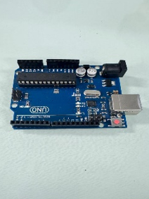
Board ຄວບຄຸມໄມໂຄຣ ສໍາລັບການພັດທະນາໂຄງການ DIY, ການຮຽນຮູ້ການຂຽນໂປລແກລມ, ການຄວບຄຸມອຸປະກອນຕ່າງໆ
### 2.	Breadboard

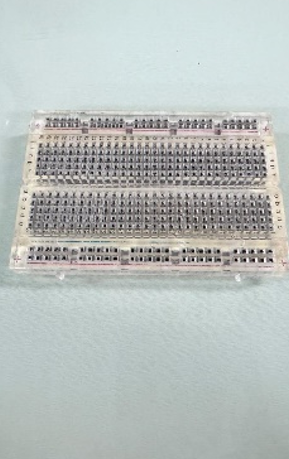

Boardໃຊ້ສໍາລັບການເຊື່ອມຕໍ່ວົງຈອນໄຟຟ້າຊົ່ວຄາວ ຫຼື ໃຊ້ເພື່ອທົດສອບວົງຈອນຕ່າງໆ ກ່ອນທີ່ຈະ soldering ໃສ່Boardວົງຈອນ

### 3.	Resistor
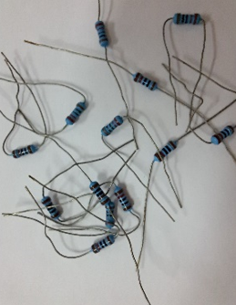
ເປັນອຸປະກອນທີ່ເຮັດໜ້າຫຼຸດຜ່ອນແຮງດັນໄຟຟ້າໃນວົງຈອນ. ຄວບຄຸມກະແສໄຟຟ້າໃນວົງຈອນ ໃຊ້ໃນທຸກວຽກງານເອເລັກໂຕຣນິກ

### 4.	pin header (male,female)

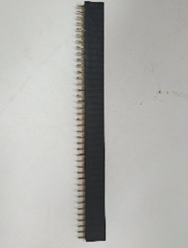 
ເປັນອຸປະກອນທີ່ເຊື່ອມຕໍ່ວົງຈອນຫຼືສາຍໄຟໃນຮູບແບບ plug-in. ເຫມາະສໍາລັບການເຊື່ອມຕໍ່ກັບໂມດູນຫຼືBoardວົງຈອນ.

### 5.	Jumper
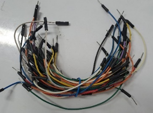 
ສາຍທີ່ໃຊ້ເພື່ອເຊື່ອມຕໍ່ລະຫວ່າງ pins ອຸປະກອນຕ່າງໆຢູ່ໃນກະດານແລະ Breadboard.
### 6.	LED
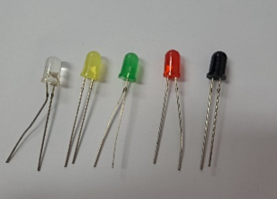
ໃຊ້ເພື່ອສະແດງສະຖານະຫຼືການສະຫວ່າງ. ມີຢູ່ໃນຫຼາຍສີແລະຂະຫນາດ. ໃຊ້ໃນວຽກງານເອເລັກໂຕຣນິກທົ່ວໄປ

### 7.	RGB LED
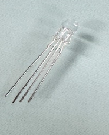
 
ເປັນຫລອດໄຟ LED ທີ່ມີສີແດງ, ສີຂຽວ, ແລະສີຟ້າຢູ່ໃນຫລອດດຽວ. ແສງສະຫວ່າງສາມາດໄດ້ຮັບການປະສົມເພື່ອສ້າງສີທີ່ແຕກຕ່າງກັນ.

### 8.	saven-segment 5611
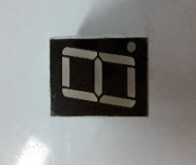
  

ຈໍສະແດງຜົນ 7-segment ໃຊ້ເພື່ອສະແດງຕົວເລກເຊັ່ນ: 0-9.

### 9.	segment
 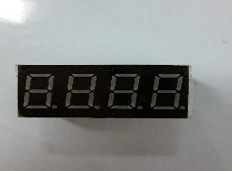

ການສະແດງ segment 7 ຕົວເລກຕິດຕໍ່ກັນໃຊ້ເພື່ອສະແດງເວລາ ຫຼືຕົວເລກຍາວ.

### 10.	Button control(mini, switch)
 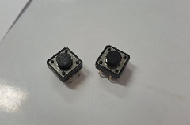
       

ໃຊ້: ເປີດ/ປິດປຸ່ມກົດ ຫຼືຄວບຄຸມການເຮັດວຽກຂອງວົງຈອນ ເຫມາະສໍາລັບໂຄງການຄວບຄຸມ.

### 11.	Buzzer
 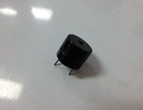
 

ສົ່ງສຽງແຈ້ງເຕືອນຫຼືໃຊ້ໃນໂຄງການທີ່ຕ້ອງການສຽງເຊັ່ນ: ໂມງປຸກ, ລະບົບປຸກ.

### 12.	Servo
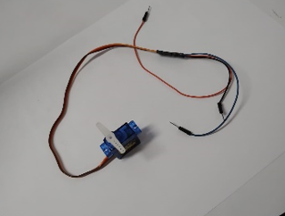
 
ເປັນມໍເຕີທີ່ສາມາດຄວບຄຸມຕໍາແຫນ່ງຫມຸນ. ໃຊ້ທົ່ວໄປໃນວຽກງານການຄວບຄຸມການເຄື່ອນໄຫວ, ເຊັ່ນ: ການຄວບຄຸມແຂນກົນຈັກ.

### 13.	IcN74HC595N

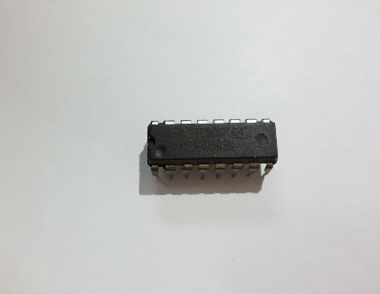
 

ຂະຫຍາຍພອດແມ່ນໃຊ້ເພື່ອຄວບຄຸມໄຟ LED ຫຼືອຸປະກອນທີ່ຕ້ອງການພອດຫຼາຍພອດໂດຍນໍາໃຊ້ພອດຫນ້ອຍລົງຈາກໄມໂຄຄອນຄວບຄຸມ.

### 14.	Bluetooht Module

 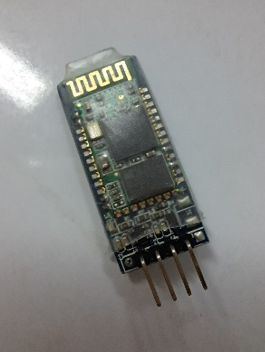

ໃຊ້ເພື່ອຕິດຕໍ່ສື່ສານໄຮ້ສາຍຜ່ານ Bluetooth, ເຫມາະສໍາລັບການສົ່ງຂໍ້ມູນລະຫວ່າງອຸປະກອນເຊັ່ນ: ໂທລະສັບມືຖືແລະ Arduino.

### 15.	Battery DC 9V
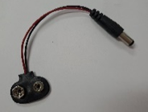
 

ແຫຼ່ງພະລັງງານສໍາລັບວົງຈອນຫຼືອຸປະກອນ Portable. ໃຊ້ໃນໂຄງການທີ່ບໍ່ຈໍາເປັນຕ້ອງສຽບໄຟໃນເຮືອນ.

### 16.	USB cable
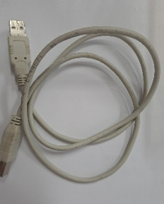
 

ສາຍເຊື່ອມຕໍ່ສໍາລັບການສົ່ງຂໍ້ມູນແລະການສະຫນອງພະລັງງານ, ເຊັ່ນ: ການເຊື່ອມຕໍ່ Arduino ກັບຄອມພິວເຕີ

### 17.	Joy stick module

 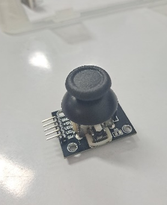

ຄວບຄຸມການເຄື່ອນໄຫວໃນຫຼາຍທິດທາງ, ເຊັ່ນ: ຫຸ່ນຍົນຫຼືຄວບຄຸມເກມ.

### 18.	Potentiometer(10k ohm linear taper rotary potentiometer)

 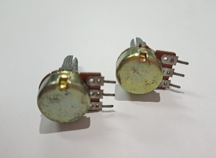

ໃຊ້ເພື່ອປັບແຮງດັນໄຟຟ້າໃນວົງຈອນໄດ້ດີສໍາລັບການປັບຄວາມສະຫວ່າງ, ລະດັບສຽງ, ຫຼືການຕັ້ງຄ່າໃນອຸປະກອນຕ່າງໆ.

### 19.	LED Matrix

 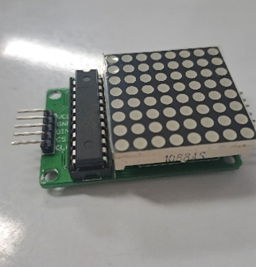

ຂໍ້ຄວາມຫຼືຮູບແບບທີ່ມີໄຟ LED, ເຫມາະສໍາລັບປ້າຍໂຄສະນາ, ໂມງ, ຫຼືເຄື່ອງຕົກແຕ່ງ.

### 20.	LCD display 1602

 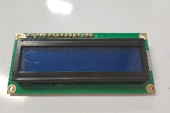

ຈໍສະແດງຜົນທີ່ໃຊ້ເພື່ອສະແດງຕົວອັກສອນ ແລະຕົວເລກ. ສໍາລັບການສະແດງຂໍ້ມູນຕ່າງ

### 21.	 IR LED (10*3 mm led infrared receiver 940nm IR LED diodes IR)

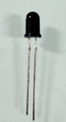 

ໃຊ້ໃນການຮັບສັນຍານ IR ທີ່ຖືກສົ່ງມາຈາກ LED ຂອງອຸປະກອນຕ່າງໆ.

# ປະເພດຂອງ SENSOR

### 1.	Ultrasonic Sensor
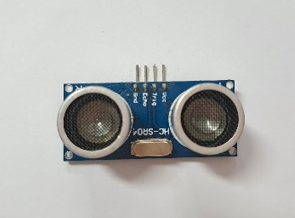 
     

ແມ່ນການວັດແທກໄລຍະຫ່າງໂດຍໃຊ້ຄື້ນສຽງ ultrasonic. ເຫມາະສໍາລັບລະບົບກວດຈັບອຸປະສັກ, ລະບົບການຄວບຄຸມໄລຍະໄກຂອງຫຸ່ນຍົນ.

### 2.	PIR Sensor

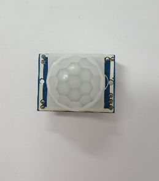               

ຕົວຈັບການເຄື່ອນໄຫວ ໃຊ້ສຳລັບລະບົບຄວາມປອດໄພ

### 3.	Reflective object sensor
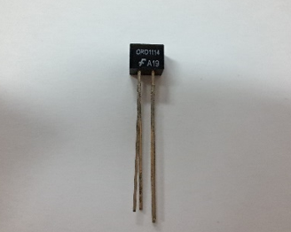   
 

ເຊັນເຊີກວດຈັບວັດຖຸສະທ້ອນ ໃຊ້ໃນການກວດຫາວັດຖຸໄລຍະໃກ້, ເຊັ່ນ: ກວດພົບເຈ້ຍໃນເຄື່ອງພິມ.

### 4.	Temperature Sensor (LM35 DZ)
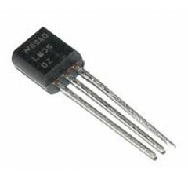   
 

ແມ່ນເຊັນເຊີທີ່ໃຊ້ວັດອຸນຫະພູມແບບລະດັບສູງ ແລະ ແມ່ນມີຄວາມແມ່ນຍຳສູງຫຼາຍ. ໂດຍຖ້າອຸນຫະພູມເພີ່ມຂຶ້ນ ຄ່າໄຟອອກທາງຂອງເຊັນເຊີກໍຈະເພີ່ມຂຶ້ນເຊັ່ນກັນ.

### 5.	Rain Drop Sensor

 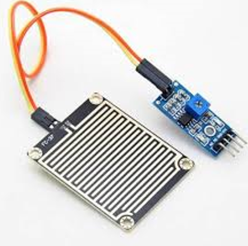   

ແມ່ນເຊັນເຊີທີ່ມີໜ້າທີ່ວັດການມາຖຶກຂອງນໍ້າຝົນ ຫຼື ຄວາມຊື່ນຫມອກໃນສະຖານທີ່ທີ່ມີນໍ້າ. ເຊັນເຊີນີ້ຖືກໃຊ້ໃນການຕິດຕັ້ງກັບລະບົບຄວບຄຸມທີ່ເຊື່ອມໂຕກັບອຸປະກອນຕ່າງໆ

### 6.	Mercury Switch Tilt Sensor
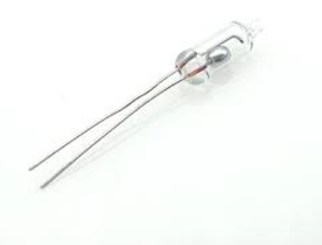   
 
ເປັນເຊັນເຊີທີ່ເປັນສະວິດສະຫຼັບໄຟຟ້າ.  ເພື່ອເປີດແລະປິດວົງຈອນຕາມຄວາມອຽງຂອງເຊັນເຊີ

    
[Go to Next Page](lab0.md)
[Back to Last Page](main.md)