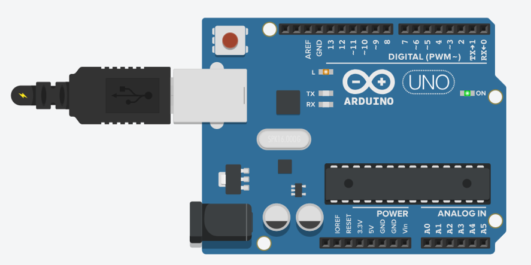
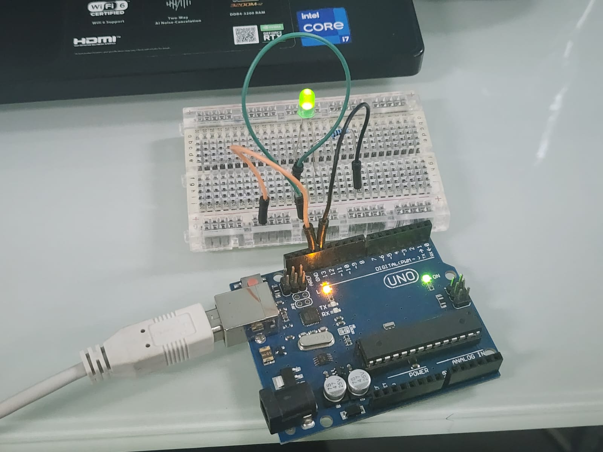
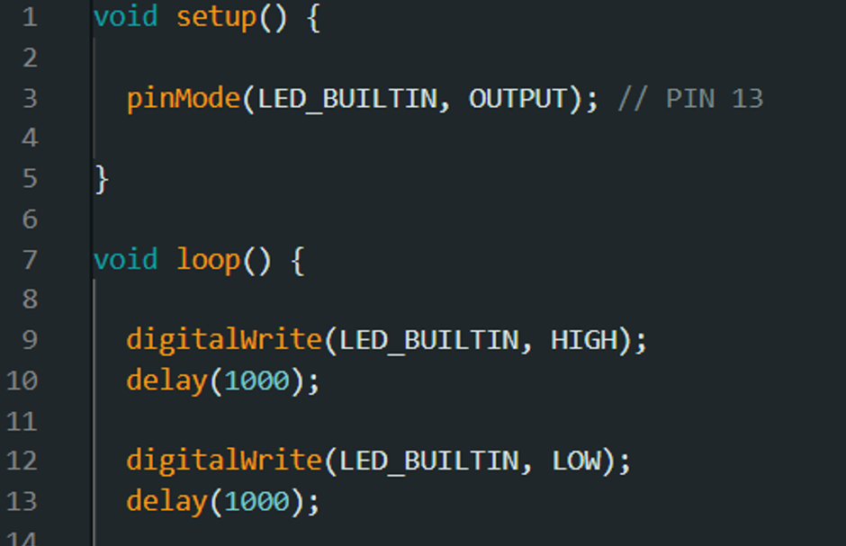

# ການທົດລອງຕໍ່ວົງຈອນ Labs  : 0 Blink

## I. ຈຸດປະສົງຂອງວົງຈອນການທົດລອງ
Blink Arduino ເປັນໂປຣເຈັກເລີ່ມຕົ້ນຂອງການຮຽນຮູ້ສຳລັບຜູ້ທີ່ຕ້ອງການເລີ່ມຕົ້ນສຶກສາໃຊ້ງານ ໄມໂຄຣຄອນໂທຣເລີ. ໂດຍການເຮັດວຽກຂອງມັນ ຈະເຮັດໃຫ້ LED ທີ່ຕິດຢູ່ພືີ້ນຂອງ LED_BUILTIN ຮຸ້ງແລະດັບທຸກໆ 1 ວິນາທີ. ຈຸດປະສົງຂອງຕໍ່ວົງຈອນ Blink Arduino ແມ່ນເພື່ອໃຊ້ໃນການກວດສອບການເຮັດວຽກຂອງບອດ(Arduino) ວ່າໃຊ້ງານໄດ້ຫລືບໍ່.

---

## II. ອຸປະກອນ

| ຊື່ | ຈຳນວນ |
|------|--------|
| Arduino IDE | 1 |
| ສາຍ USB | 1 |

---

## III. ວົງຈອນແລະ Code

 
 
___
 

___
## IV.	ຜົນຂອງການທົດລອງ
ຜົນການທົດລອງການສາມາດສະຫລຸບໄດ້ວ່າ ການເຮັດຂອງບອດ (Arduino) ນັ້ນສາມາດເຮັດວຽກໄດ້ຢ່າງປົກກະຕິ, ໂດຍມັນຈະເປັນມັນຈະເປັນການກະພິບຕາມຈັງຫວະຮຸ້ງ-ດັບ ທຸກໆ1ວິນາທີ.
[Go to Next Page](lab1.md)
[Back to Last Page](introduce.md)
