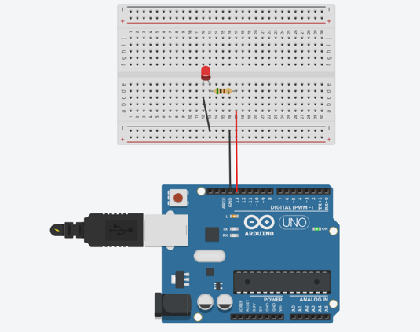
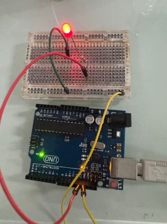

# ການທົດລອງຕໍ່ວົງຈອນ Labs  : 1 Experement Blink

## I. ຈຸດປະສົງຂອງວົງຈອນການທົດລອງ
Experement Blink ເປັນໂປຣເຈັກທີ່ມີການໃຊ້ບອດ (Arduino) ໃນການຄວບຄຸມການກະທິບຂອງດອກໄຟ LED, ໂດຍມັນຈະມີການຮຸ້ງ-ດັບສະຫລັບກັນທຸກໆ 1 ວິນາທິ.
___

## II. ອຸປະກອນ

| ຊື່            | ຈຳນວນ |
|---------------|--------|
| Arduino IDE  | 1      |
| Breadboard   | 1      |
| Resistor (220Ω) | 1      |
| LED          | 1      |
| ສາຍ USB      | 1      |
___

## III.	ວົງຈອນແລະcode
 
 
____
~~~cpp
// C++ code
//
void setup() {
// put your setup code here, to run once:

  pinMode(LED_BUILTIN, OUTPUT); // PIN 13
  
}

void loop() {
// put your main code here, to run repeatedly:
	
  digitalWrite(LED_BUILTIN, HIGH);
  delay(1000); // Wait for 1000 millisecond(s) = 1 second
  
  digitalWrite(LED_BUILTIN, LOW);
  delay(1000); // Wait for 1000 millisecond(s) = 1 second
  
}
~~~

## IV.	ຜົນຂອງການທົດລອງ
ຜົນການທົດລອງການສາມາດສະຫລຸບໄດ້ວ່າ ການເຮັດວຽກຂອງດອກໄຟ LED ນັ້ນໄດ້ມີການສະແດງຜົນຕາມທີ່ເຮົາຕ້ອງ,ໂດຍມັນຈະມີການຮຸ້ງ-ດັບສະຫລັບກັນ 1 ວິນາທີ. ໂດຍຫລັງມັນຈະເຮັດວຽກແລ້ວຈະມີການວົນຊ້ຳ(loop)ໄປເລື້ອຍໆຈົນກສ່າເຮົາສັ່ງຈຸດການເຮັດວຽກມັນ.
[Go to Next Page](lab2.md)
[Back to Last Page](lab0.md)