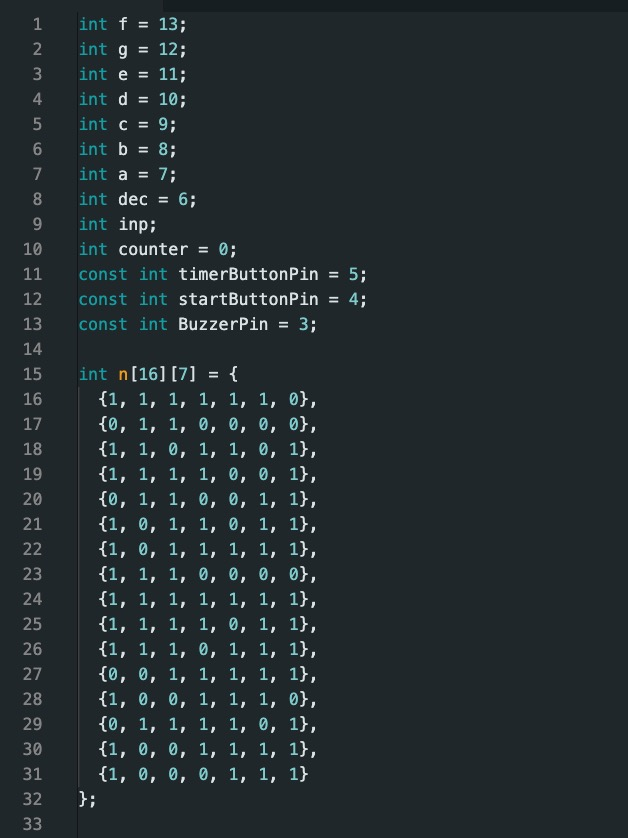

# ການທົດລອງຕໍ່ວົງຈອນ Labs  : Labs:10 ວົງຈອນນັບເວລາ

## I. ຈຸດປະສົງຂອງວົງຈອນການທົດລອງ
ຈຸດປະສົງຂອງໂປຣເຈັກນີ້ແມ່ນຢາກສ້າງລະບົບທີ່ຈະນັບເວລາເພື່ອທີ່ຈະສາມາດນຳເອົາໄປປະຍຸກໃຊ້ກັບອຸປະກອນອື່ນໆໄດ້.

___

## II. ອຸປະກອນ

| ຊື່            | ຈຳນວນ |
|---------------|--------|
| Arduino IDE  | 1      |
| Breadboard   | 1      |
|    Resistor(220Ω)  | 3     |
| Push Button      | 2      |
| Buzzer       | 1     |
| 7 Segment Display       | 1      |

___

## III.	ວົງຈອນແລະcode
 
 
<!--   -->
<!--   -->
<!--   -->
~~~cpp
int f = 13;
int g = 12;
int e = 11;
int d = 10;
int c = 9;
int b = 8;
int a = 7;
int dec = 6;
int inp;
int counter = 0;
const int timerButtonPin = 5;
const int startButtonPin = 4;
const int BuzzerPin = 3;

int n[16][7] = {
  {1, 1, 1, 1, 1, 1, 0},
  {0, 1, 1, 0, 0, 0, 0},
  {1, 1, 0, 1, 1, 0, 1},
  {1, 1, 1, 1, 0, 0, 1},
  {0, 1, 1, 0, 0, 1, 1},
  {1, 0, 1, 1, 0, 1, 1},
  {1, 0, 1, 1, 1, 1, 1},
  {1, 1, 1, 0, 0, 0, 0},
  {1, 1, 1, 1, 1, 1, 1},
  {1, 1, 1, 1, 0, 1, 1},
  {1, 1, 1, 0, 1, 1, 1},
  {0, 0, 1, 1, 1, 1, 1},
  {1, 0, 0, 1, 1, 1, 0},
  {0, 1, 1, 1, 1, 0, 1},
  {1, 0, 0, 1, 1, 1, 1},
  {1, 0, 0, 0, 1, 1, 1}
};

void setup()
{
  pinMode(f, OUTPUT);
  pinMode(g, OUTPUT);
  pinMode(e, OUTPUT);
  pinMode(d, OUTPUT);
  pinMode(c, OUTPUT);
  pinMode(b, OUTPUT);
  pinMode(a, OUTPUT);
  pinMode(dec, OUTPUT);
  pinMode(timerButtonPin, INPUT);
  pinMode(startButtonPin, INPUT);
  pinMode(BuzzerPin, OUTPUT);
  Serial.begin(9600);
}

void loop()
{
  int timerButtonState = digitalRead(timerButtonPin);
  int startTimerButtonState = digitalRead(startButtonPin);

  if (timerButtonState == LOW)
  {
    counter++;
    if (counter >= 10) {
      counter = 0;
    }
    tone(BuzzerPin, 500, 200);
    Serial.print("Counter-Set: ");
    Serial.println(counter);
    num(counter);
    delay(150);
  }

  if (startTimerButtonState == LOW) {
    startReverseTimer(counter);
  }
}

void startReverseTimer(int time) {
  for (int i = 0; i < time; i++)
  {
    num(time - i);
    tone(BuzzerPin, 500, 200);
    digitalWrite(dec, HIGH);
    Serial.print("Counter-Reverse: ");
    Serial.println(time - i);
    delay(1000);
  }
  Serial.print("Counter-Reverse: Reset to ");
  num(0);
  tone(BuzzerPin, 200);
  delay(1000);
  noTone(BuzzerPin);
}

void num(int i)
{
  digitalWrite(a, n[i][0]);
  digitalWrite(b, n[i][1]);
  digitalWrite(c, n[i][2]);
  digitalWrite(d, n[i][3]);
  digitalWrite(e, n[i][4]);
  digitalWrite(f, n[i][5]);
  digitalWrite(g, n[i][6]);
}

~~~

## IV.	ຜົນຂອງການທົດລອງ
ຜົນການທົດລອງການສາມາດສະຫລຸບໄດ້ວ່າ: ເວລາເຮົາກົດButtonຕົວທຳອິດຈະເລີ່ມນັບ1,ກົດຄັ້ງທີ່2ກໍຈະນັບ2ເຊິ່ງຕົວເລກຈະສະແດງຢູ່7sagment,ສ່ວນຂອງbuzzerແມ່ນຈະສົ່ງສຽງດັງຂຶ້ນຕາມລຳດັບ.ຫລັງຈາກນັ້ນເມື່ອເຮົາກົດButtonຕົວທີ່2ສຽງກໍຈະຄ່ອຍໆເບົາໆລົງແລ້ວຕົວເລກທີ່ເຮົາກຳນົດໄວ້ກໍຈະນັດຖອຍຫລັງຈົນຮອດ0.
[Go to Next Page](qr_link.md)
[Back to Last Page](lab9.md)