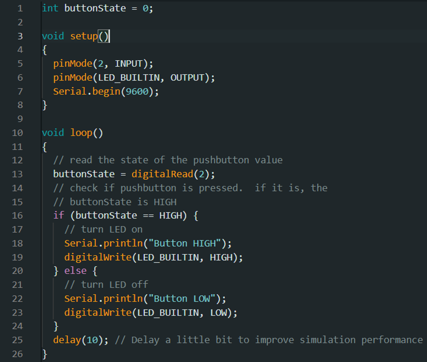

# ການທົດລອງຕໍ່ວົງຈອນ Labs  : 2 Switch

## I. ຈຸດປະສົງຂອງວົງຈອນການທົດລອງ
Switch or Push button (ປຸ່ມກົດ) ເປັນອຸປະກອນໄຟຟ້າທີ່ໃຊ້ໃນວົງຈອນອິເລັກໂທຣນິກ ເພື່ອປິດຫຼືເປີດວົງ ຫລື ສົ່ງສັນຍານໄປຍັງວົງຈອນ. ໂດຍມັນຈະມີການເຮັດວຽກລັກສະນະເມື່ອມີການກົດລົງເພື່ອເຮັດໃຫ້ວົງຈອນມີກະແສໄຟຟ້າແລ່ນຜ່ານໄປຍັງວົງຈອນ. 
Switch or Push button ໃນໂປຣເຈັກນີ້ຈະເປັນການນຳໃຊ້ Switch ໃນການຄວບຄຸມໄຟຈາກບອດເພື່ອໃຫ້ໄຟຈາກບອດນັ້ນຮຸ້ງແລະດັບ.

___

## II. ອຸປະກອນ

| ຊື່            | ຈຳນວນ |
|---------------|--------|
| Arduino IDE  | 1      |
| Breadboard   | 1      |
| Resistor (220Ω) | 1      |
| Push button          | 1      |

___

## III.	ວົງຈອນແລະcode
 
 
 

## IV.	ຜົນຂອງການທົດລອງ
ຜົນການທົດລອງການສາມາດສະຫລຸບໄດ້ວ່າ ການເຮັດວຽກຂອງດອກໄຟ LED ນັ້ນໄດ້ມີການສະແດງຜົນຕາມທີ່ເຮົາຕ້ອງ,ໂດຍມັນຈະມີການຮຸ້ງ-ດັບສະຫລັບກັນ 1 ວິນາທີ. ໂດຍຫລັງມັນຈະເຮັດວຽກແລ້ວຈະມີການວົນຊ້ຳ(loop)ໄປເລື້ອຍໆຈົນກສ່າເຮົາສັ່ງຈຸດການເຮັດວຽກມັນ.
[Go to Next Page](lab3.md)
[Back to Last Page](lab1.md)