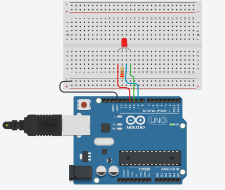
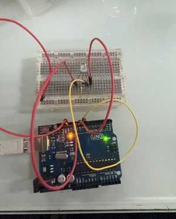
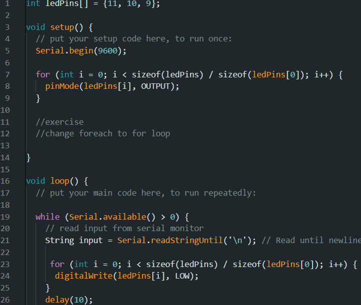
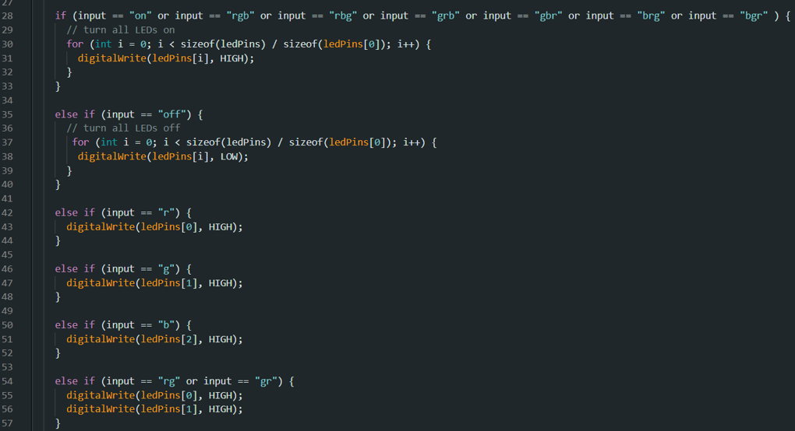
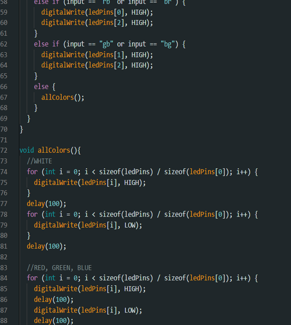
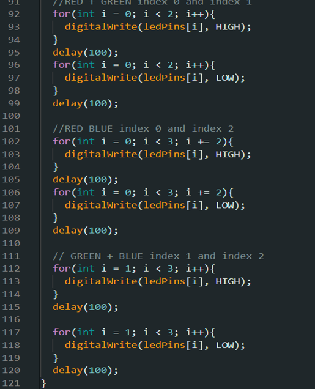

# ການທົດລອງຕໍ່ວົງຈອນ Labs  : 3 RGB

## I. ຈຸດປະສົງຂອງວົງຈອນການທົດລອງ
RGB ແມ່ນ ຊຸດຫຼອດໄຟ LED ທີ່ມີຫຼອດໄຟ LED ສີແດງ, ຂຽວ ແລະນ້ຳເງິນລວມກັນໃນຊຸດດຽວ ຕາມປົກກະຕິແລ້ວ ໄຟ LED ແບບ RGB ສາມາດສ້າງສີຕ່າງໆ ທີ່ມອງເຫັນໄດ້ຄ່ອນຂ້າງຄົບຄຸມ. ຢ່າງໃດກໍ່ຕາມ, ຂໍ້ຈຳກັດຂອງໄຟປະເພດນີ້ ແມ່ນວ່າທັງຊຸດຂອງໄຟ LED ຈະສາມາດສ້າງແສງສີດຽວໃນເວລາດຽວກັນເທົ່ານັ້ນ ແລະໃຊ້ເອັຟເຟັກແສງແບບດຽວກັນ ເນື່ອງຈາກມີ IC ຕົວດຽວຄວບຄຸມການເຮັດວຽກ.
RGB ໃນໂປຣເຈັກນີ້ຈະເປັນການທີ່ທີ່ໃຊ້ຄໍາສັ່ງໃຫ້ດອກໄຟປ່ຽນສີຂອງມັນຕາມຄ່າທີ່ເຮົາເຊັດໄວ້ ແລະ ໃຊ້ຄຳສັ່ງໂດຍສັ່ງຜ່ານ Serial Monitor ຫລື ຜ່ານບອດຂອງວົງຈອນໃນການປ່ຽນສີຂອງໂດຍໄຟ.

___

## II. ອຸປະກອນ

| ຊື່            | ຈຳນວນ |
|---------------|--------|
| Arduino IDE  | 1      |
| Breadboard   | 1      |
| Resistor (220Ω) | 1      |
| RGB         | 1      |

___

## III.	ວົງຈອນແລະcode
 
 
 
 
 
 
## IV.	ຜົນຂອງການທົດລອງ
ຜົນການທົດລອງການສາມາດສະຫລຸບໄດ້ວ່າ ການເຮັດວຽກຂອງດອກໄຟ LED ນັ້ນໄດ້ມີການສະແດງຜົນຕາມທີ່ເຮົາຕ້ອງ,ໂດຍມັນຈະມີການຮຸ້ງ-ດັບສະຫລັບກັນ 1 ວິນາທີ. ໂດຍຫລັງມັນຈະເຮັດວຽກແລ້ວຈະມີການວົນຊ້ຳ(loop)ໄປເລື້ອຍໆຈົນກສ່າເຮົາສັ່ງຈຸດການເຮັດວຽກມັນ.
[Go to Next Page](lab4.md)
[Back to Last Page](lab2.md)