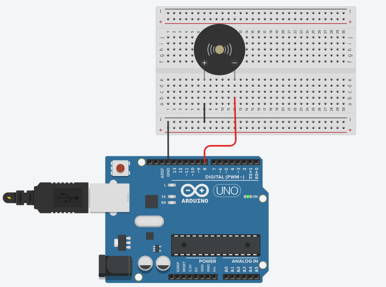
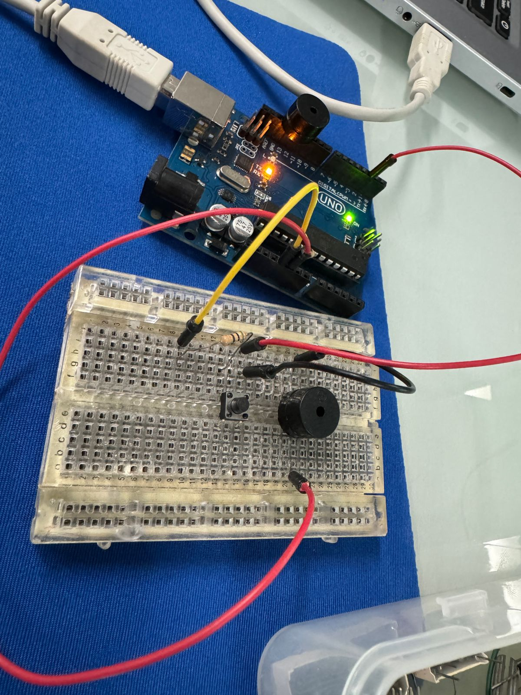
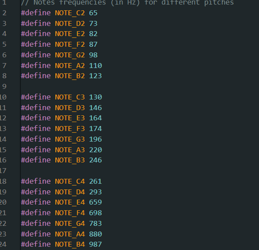
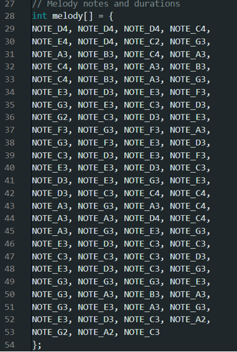
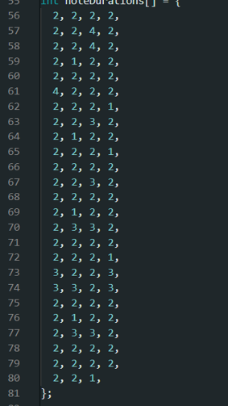
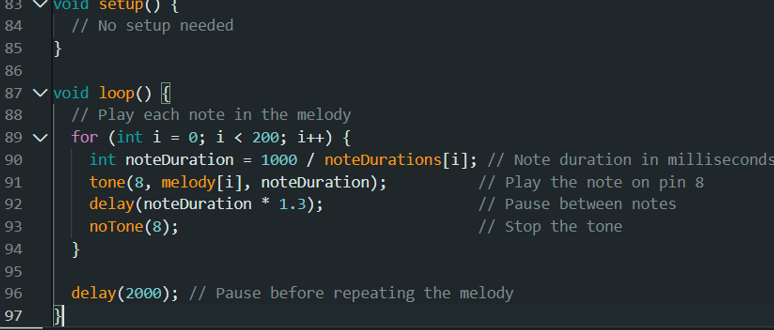

# ການທົດລອງຕໍ່ວົງຈອນ Labs  : 4 Buzzer

## I. ຈຸດປະສົງຂອງວົງຈອນການທົດລອງ
Buzzer (ບັຊເຊີຣ໌) ຄື ອຸປະກອນກຳເນີດສຽງ ທີ່ໃຊ້ໃນລະບົບອີເລັກໂທຣນິກ ເພື່ອສ້າງສຽງແຈ້ງເຕືອນ, ສັນຍານ, ຫລືເພື່ອໃຫ້ສຽງປິ່ງປ່ອງຕ່າງໆ. ປະເພດຂອງ Buzzer ມີຄື:
1.	Passive Buzzer (ບັຊເຊີຣ໌ແບບບໍ່ມີວົງຈອນ)
o	ຕ້ອງໃຊ້ສັນຍານຄວາມຖີ່ (PWM) ເພື່ອຄວບຄຸມສຽງ
o	ສາມາດສ້າງສຽງດັງ ແລະ ປ່ຽນຄວາມຖີ່ສຽງໄດ້
2.	Active Buzzer (ບັຊເຊີຣ໌ແບບມີວົງຈອນໃນຕົວ)
o	ໃຫ້ສຽງໄດ້ໂດຍການຈ່າຍໄຟ DC ໃສ່
o	ສຽງຄົງທີ່ ແລະ ບໍ່ສາມາດປ່ຽນຄວາມຖີ່ໄດ້
3.	Buzzer (ບັຊເຊີຣ໌) ໃນໂປຣເຈັກນີ້ຈະເປັນການທີ່ເຮົາຈະເຮັດໃຫ້ມັນສົາງສຽງເປັນໂນດຂອງເພງຊາດລາວຂອງເຮົາ.

___

## II. ອຸປະກອນ

| ຊື່            | ຈຳນວນ |
|---------------|--------|
| Arduino IDE  | 1      |
| Breadboard   | 1      |
| Buzzer         | 1      |

___

## III.	ວົງຈອນແລະcode
 
 
 
 
 
 
## IV.	ຜົນຂອງການທົດລອງ
ຜົນການທົດລອງການສາມາດສະຫລຸບໄດ້ວ່າ: ໂປຣເຈັກນີ້ຈະເປັນການສົ່ງສຽງຕາມຄຳສັ່ງຂອງເຮົາເຊັດຄ່າເອົາໄວ້. ເຊີ່ງໄດ້ມີການເລືອກເປັນໂນດຂອງເພງຊາດລາວ.
[Go to Next Page](lab5.md)
[Back to Last Page](lab3.md)