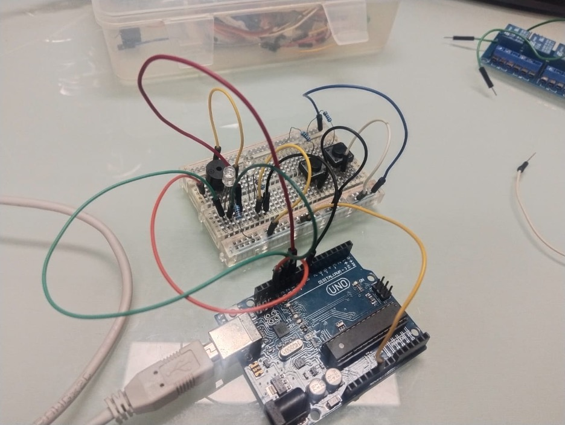
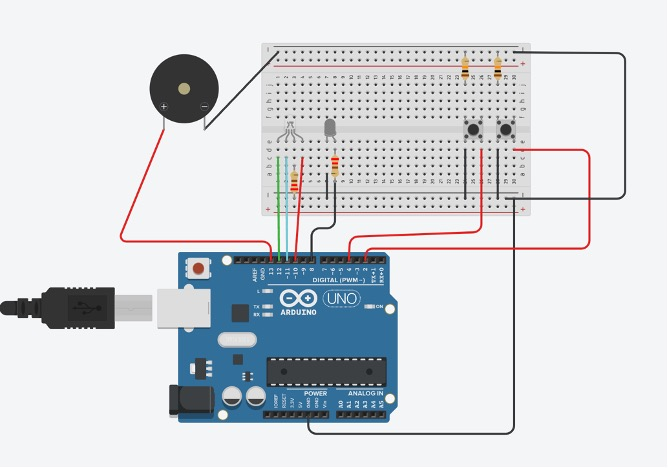
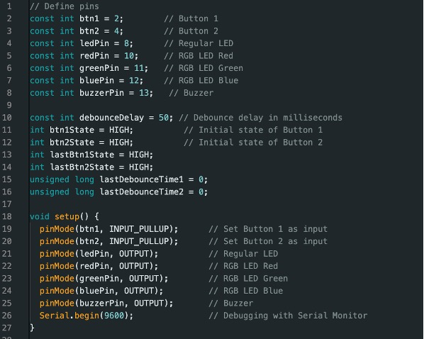
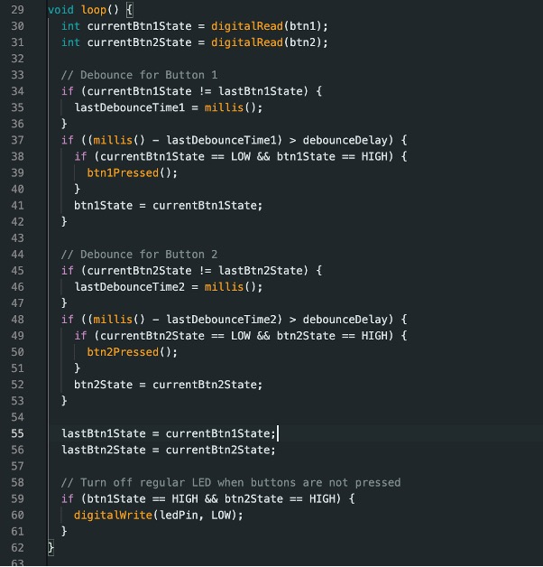
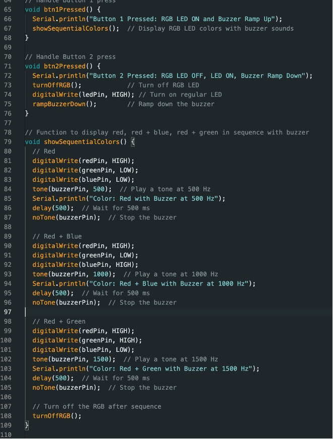
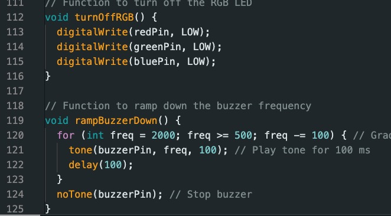

# ການທົດລອງຕໍ່ວົງຈອນ Labs  : 5 ລະບົບແຈ້ງເຕືອນໄຟໄໝ້(midtern Project)

## I. ຈຸດປະສົງຂອງວົງຈອນການທົດລອງ
ຈຸດປະສົງຂອງໂປຣເຈັກນີ້ແມ່ນເຮົາຢາກສ້າງລະບົບໃນການແຈ້ງເຕືອນໄຟໄໝ້ເພາະໄຟໄໝ້ຖືວ່າເປັນເຫດການທີ່ທຸກຄົນບໍຢາກໃຫ້ເກີດຂຶ້ນເພາະມັນສົ່ງຜົນເສຍຫຼາຍດ້ານຖ້ານັ້ນຈະດີກວ່າບໍຖ້າເຮົາມີລະບົບທີ່ສາມາດແຈ້ງເຕືອນໄຟໄໝ້ໃຫ້ທຸກຄົນສາມາດຮູ້ທັນແລະກຽມພ້ອມໃນການຮັບມືກັບມັນ.

___

## II. ອຸປະກອນ

| ຊື່            | ຈຳນວນ |
|---------------|--------|
| Arduino IDE  | 1      |
| Breadboard   | 1      |
| Resistor(220Ω)  | 4     |
| Pushbutton        | 2      |
| LED         | 1      |
| Buzzer         | 1      |
| RGB        | 1      |

___

## III.	ວົງຈອນແລະcode
 
 

<!--  
 
 
  -->
~~~cpp
// Define pins
const int btn1 = 2;        // Button 1
const int btn2 = 4;        // Button 2
const int ledPin = 8;      // Regular LED
const int redPin = 10;     // RGB LED Red
const int greenPin = 11;   // RGB LED Green
const int bluePin = 12;    // RGB LED Blue
const int buzzerPin = 13;   // Buzzer

const int debounceDelay = 50; // Debounce delay in milliseconds
int btn1State = HIGH;          // Initial state of Button 1
int btn2State = HIGH;          // Initial state of Button 2
int lastBtn1State = HIGH;
int lastBtn2State = HIGH;
unsigned long lastDebounceTime1 = 0;
unsigned long lastDebounceTime2 = 0;

void setup() {
  pinMode(btn1, INPUT_PULLUP);      // Set Button 1 as input
  pinMode(btn2, INPUT_PULLUP);      // Set Button 2 as input
  pinMode(ledPin, OUTPUT);          // Regular LED
  pinMode(redPin, OUTPUT);          // RGB LED Red
  pinMode(greenPin, OUTPUT);        // RGB LED Green
  pinMode(bluePin, OUTPUT);         // RGB LED Blue
  pinMode(buzzerPin, OUTPUT);       // Buzzer
  Serial.begin(9600);               // Debugging with Serial Monitor
}

void loop() {
  int currentBtn1State = digitalRead(btn1);
  int currentBtn2State = digitalRead(btn2);

  // Debounce for Button 1
  if (currentBtn1State != lastBtn1State) {
    lastDebounceTime1 = millis();
  }
  if ((millis() - lastDebounceTime1) > debounceDelay) {
    if (currentBtn1State == LOW && btn1State == HIGH) {
      btn1Pressed();
    }
    btn1State = currentBtn1State;
  }

  // Debounce for Button 2
  if (currentBtn2State != lastBtn2State) {
    lastDebounceTime2 = millis();
  }
  if ((millis() - lastDebounceTime2) > debounceDelay) {
    if (currentBtn2State == LOW && btn2State == HIGH) {
      btn2Pressed();
    }
    btn2State = currentBtn2State;
  }

  lastBtn1State = currentBtn1State;
  lastBtn2State = currentBtn2State;

  // Turn off regular LED when buttons are not pressed
  if (btn1State == HIGH && btn2State == HIGH) {
    digitalWrite(ledPin, LOW);
  }
}

// Handle Button 1 press
void btn1Pressed() {
  Serial.println("Button 1 Pressed: RGB LED ON and Buzzer Ramp Up");
  showSequentialColors();  // Display RGB LED colors with buzzer sounds
}

// Handle Button 2 press
void btn2Pressed() {
  Serial.println("Button 2 Pressed: RGB LED OFF, LED ON, Buzzer Ramp Down");
  turnOffRGB();            // Turn off RGB LED
  digitalWrite(ledPin, HIGH); // Turn on regular LED
  rampBuzzerDown();        // Ramp down the buzzer
}

// Function to display red, red + blue, red + green in sequence with buzzer
void showSequentialColors() {
  // Red
  digitalWrite(redPin, HIGH);
  digitalWrite(greenPin, LOW);
  digitalWrite(bluePin, LOW);
  tone(buzzerPin, 500);  // Play a tone at 500 Hz
  Serial.println("Color: Red with Buzzer at 500 Hz");
  delay(500);  // Wait for 500 ms
  noTone(buzzerPin);  // Stop the buzzer

  // Red + Blue
  digitalWrite(redPin, HIGH);
  digitalWrite(greenPin, LOW);
  digitalWrite(bluePin, HIGH);
  tone(buzzerPin, 1000);  // Play a tone at 1000 Hz
  Serial.println("Color: Red + Blue with Buzzer at 1000 Hz");
  delay(500);  // Wait for 500 ms
  noTone(buzzerPin);  // Stop the buzzer

  // Red + Green
  digitalWrite(redPin, HIGH);
  digitalWrite(greenPin, HIGH);
  digitalWrite(bluePin, LOW);
  tone(buzzerPin, 1500);  // Play a tone at 1500 Hz
  Serial.println("Color: Red + Green with Buzzer at 1500 Hz");
  delay(500);  // Wait for 500 ms
  noTone(buzzerPin);  // Stop the buzzer

  // Turn off the RGB after sequence
  turnOffRGB();
}

// Function to turn off the RGB LED
void turnOffRGB() {
  digitalWrite(redPin, LOW);
  digitalWrite(greenPin, LOW);
  digitalWrite(bluePin, LOW);
}

// Function to ramp down the buzzer frequency
void rampBuzzerDown() {
  for (int freq = 2000; freq >= 500; freq -= 100) { // Gradually decrease frequency
    tone(buzzerPin, freq, 100); // Play tone for 100 ms
    delay(100);
  }
  noTone(buzzerPin); // Stop buzzer
}
~~~

## IV.	ຜົນຂອງການທົດລອງ
ຜົນການທົດລອງການສາມາດສະຫລຸບໄດ້ວ່າ: ເວລາເຮົາກົດbuttonຕົວທຳອິດRGBກ່ໍຈະສົ່ງແສງອອກມາເປັນຫຼາຍສີແລະPiezoກ່ໍຈະຮ້ອງສຽງດັງຂຶ້ນເລື້ອຍໆເພື່ອເປັນສັນຍານແຈ້ງເຕືອນໄຟໄໝ້.ເມື່ອກົດButtonຕົວທີ່ສອງLEDກໍຈະສົ່ງແສງອອກມາເພື່ອເປັນການແຈ້ງວ່າໄຟໄໝ້ໄດ້ມອດລົງແລ້ວ,ສຽງທີ່ດັງອອກຈາກPiezoກໍຈະຄ່ອຍໆຜ່ອນລົງຈົນງຽບ.
[Go to Next Page](lab6.md)
[Back to Last Page](lab4.md)