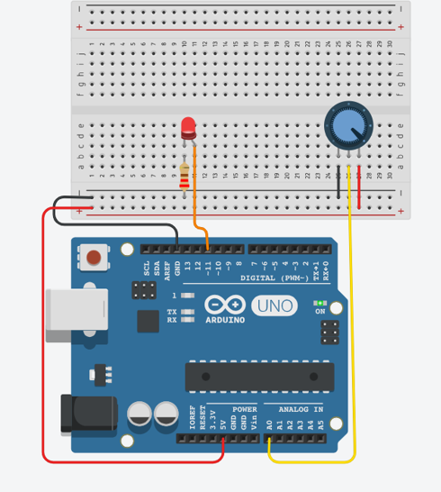
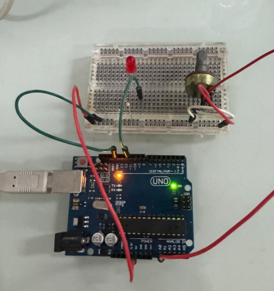
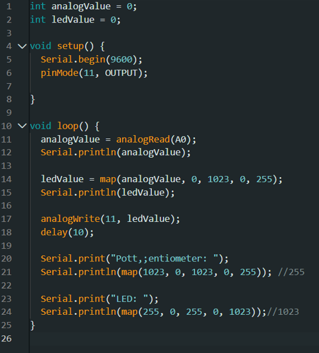

# ການທົດລອງຕໍ່ວົງຈອນ Labs  : 6 Potentiometer

## I. ຈຸດປະສົງຂອງວົງຈອນການທົດລອງ
Potentiometer ແມ່ນອຸປະກອນອິເລັກໂທຣນິກທີ່ໃຊ້ໃນການຄວບຄຸມແຮງດັນໄຟຟ້າ ຫຼື ກະແສໄຟຟ້າ ໂດຍການປັບຄ່າຄວາມຕ້ານທານໃຫ້ແປຜັນໄດ້. ອຸປະກອນນີ້ມີບົດບາດສຳຄັນໃນການຄວບຄຸມຄວາມແຈ້ງຂອງໄຟ, ລະດັບສຽງ, ຫຼື ຄວາມໄວຂອງມໍເຕີໃນອຸປະກອນຕ່າງໆ.
Potentiometer ເປັນໂປຣເຈັກທີ່ຈະໃຊ້ໃນການຄວບຄຸມຄວາມຮຸ້ງຂອງດອກໄຟ LED ຕາມທີ່ເຮົາຕ້ອງການ.

___

## II. ອຸປະກອນ

| ຊື່            | ຈຳນວນ |
|---------------|--------|
| Arduino IDE  | 1      |
| Breadboard   | 1      |
| Resistor(220Ω)  | 1     |
| Potentiometer        | 1      |
| LED         | 1      |

___

## III.	ວົງຈອນແລະcode
 
 
 
## IV.	ຜົນຂອງການທົດລອງ
ຜົນການທົດລອງການສາມາດສະຫລຸບໄດ້ວ່າ: ໂປຣເຈັກນີ້ເປັນການຄວບຄຸມຄວາມສະຫວ່າງຂອງດອກໄຟ LED ຜ່ານໂຕຂອງ Potentiometer ເຊີ່ງເມື່ອເຮົາຄ່ອຍໆໜຸມໂຕຂອງ Potentiometer ຈະເຫັນໄດ້ວ່າ ດອກໄຟຈະມີການໄຕ່ສະດັບຄວາມສະຫວ່າງຂື້ນຈົນເຄິງຄ່າສຸງສຸດ.
[Go to Next Page](lab7.md)
[Back to Last Page](lab5.md)