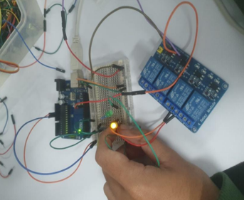
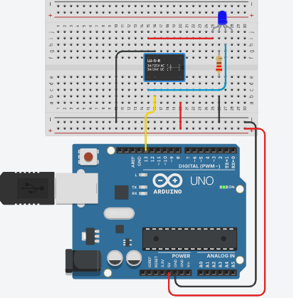
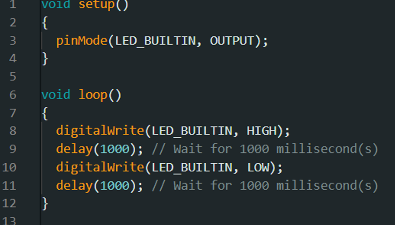

# ການທົດລອງຕໍ່ວົງຈອນ Labs  : 7 Relay

## I. ຈຸດປະສົງຂອງວົງຈອນການທົດລອງ
Relay ເປັນອຸປະກອນທີ່ເຮັດໜ້າທີ່ເໝືອນສະວິດໄຟຟ້າ ແລະ ມີບົດບາດສຳຄັນໃນການຄວບຄຸມການໄຫຼຂອງໄຟຟ້າໃຫ້ເປັນໄປຕາມທີ່ກຳນົດ. ຣີເລມີຫຼາຍປະເພດໃຫ້ເລືອກຕາມການນຳໃຊ້ໃນສະພາບແວດລ້ອມຕ່າງໆ. ຂະບວນການເຮັດວຽກຂອງມັນຄ້າຍຄືກັນ ໂດຍມີໜ້າທີ່ຕັດວົງຈອນໃນກໍລະນີທີ່ເກີດຄວາມຜິດປົກກະຕິ ເພື່ອຫຼຸດຄວາມເສຍຫາຍຕໍ່ອຸປະກອນໄຟຟ້າໃຫ້ໜ້ອຍທີ່ສຸດ.Relay ເປັນໂປຣເຈັກໃນການທີ່ຄວບຸມຂອງດອກໄຟ LED 

___

## II. ອຸປະກອນ

| ຊື່            | ຈຳນວນ |
|---------------|--------|
| Arduino IDE  | 1      |
| Breadboard   | 1      |
| Resistor(220Ω)  | 1     |
| RGB       | 1      |
| Relay        | 1      |

___

## III.	ວົງຈອນແລະcode
 
 
 
## IV.	ຜົນຂອງການທົດລອງ
ຜົນການທົດລອງການສາມາດສະຫລຸບໄດ້ວ່າ: ໂດຍມັນເປັນວົງຈອນທີ່ຈະໃຊ້ Relay ໃຫ້ກັບດອກໄຟ LED 2 ດອກ ເມື່ອດອກໄຟ1ຮຸ້ງແລ້ວມັນຈະມີການ Relay ຈາກນັ້ນດອກໄຟດອກ2ກໍ່ຈະຮຸ້ງ ສ່ວນດອກທີ່1 ກໍຈະດັບລົງໄປ.
[Go to Next Page](lab8.md)
[Back to Last Page](lab6.md)