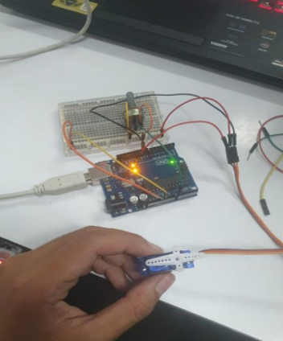
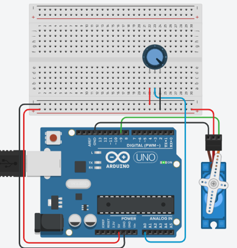
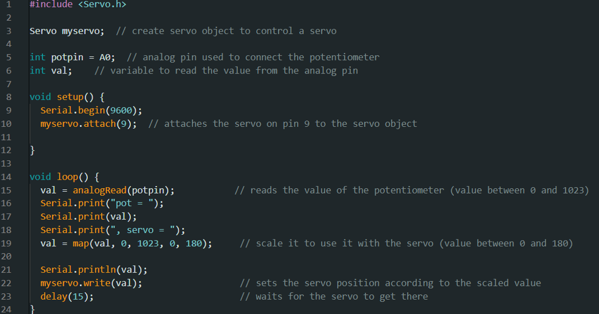

# ການທົດລອງຕໍ່ວົງຈອນ Labs  : 8 Servo Motor

## I. ຈຸດປະສົງຂອງວົງຈອນການທົດລອງ
Servo Motor ແມ່ນອຸປະກອນທີ່ສາມາດຄວບຄຸມເຄື່ອງຈັກ ຫລື ລະບົບການເຮັດວຽກໃຫ້ເປັນໄປຕາມຄວາມຕ້ອງການ ເຊັ່ນ ຄວບຄຸມຄວາມໄວ (Speed), ຄວບຄຸມແຮງບິດ (Torque), ຄວບຄຸມຕໍາແໜ່ງ (Position) ໂດຍໃຫ້ຜົນລັບຕາມຄວາມຕ້ອງການດ້ວຍຄວາມແມ່ນຍໍາສູງ.
Servo Motor ເປັນໂປຣເຈັກທີ່ໃຊ້ໂຕຂອງ Potentiometer ໃນການຄວນບຄຸມການໝຸມຂອງ Motor.

___

## II. ອຸປະກອນ

| ຊື່            | ຈຳນວນ |
|---------------|--------|
| Arduino IDE  | 1      |
| Breadboard   | 1      |
| Potentiometer      | 1      |
| Servo Motor        | 1      |

___

## III.	ວົງຈອນແລະcode
 
 
 
## IV.	ຜົນຂອງການທົດລອງ
ຜົນການທົດລອງການສາມາດສະຫລຸບໄດ້ວ່າ: ໂດຍມັນເປັນວົງຈອນທີ່ຈະໃຊ້ Potentiometer ໃນການຄວບຄຸມການໝຸມຂອງ Servo Motor. ເຊີ່ງ Servo Motor ມັນຈະມີການໝຸມຈະມີການເຄື່ອນທີ່ຕາມການບິດຂອງ Potentiometer ແລະ ມັນຈະສາມາດໝຸມໄດ້ທີ່ 180 ອົງສາ.
[Go to Next Page](lab9.md)
[Back to Last Page](lab7.md)