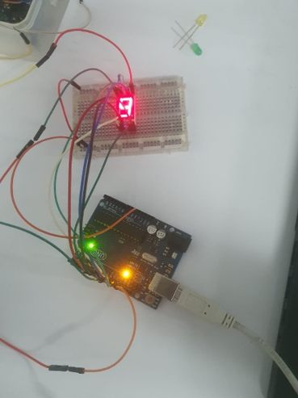
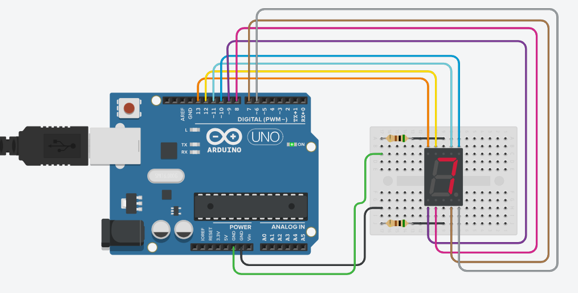
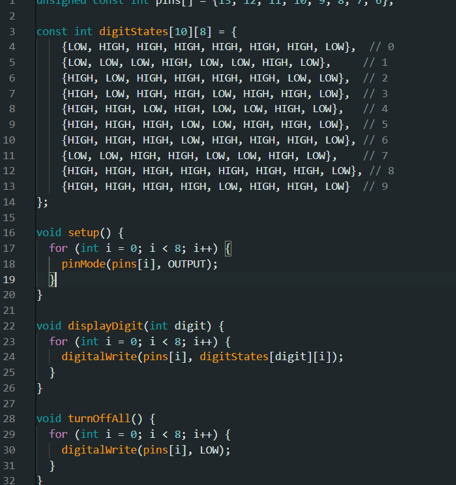
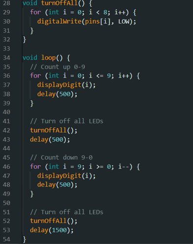

# ການທົດລອງຕໍ່ວົງຈອນ Labs  : Labs:9 seven Segment Display (ນັບຈາກ0-9ແລະ9-0)

## I. ຈຸດປະສົງຂອງວົງຈອນການທົດລອງ
7 Segment Display ຫລື ຈໍສະແດງຜົນ 7 ສ່ວນ ແມ່ນອຸປະກອນອິເລັກທຣອນິກທີ່ໃຊ້ໃນການແສດງຕົວເລກ ແລະ ໃນບາງຄັ້ງກໍ່ສາມາດໃຊ້ແສດງຕົວອັກສອນບາງຕົວໄດ້. ມັນປະກອບຂຶ້ນຈາກຫລອດໄຟ LED ຫລື LCD ຈໍານວນ 7 ສ່ວນຫລັກ ທີ່ຖືກຈັດຮູບແບບໃຫ້ເປັນຮູບແບບສະເພາະເພື່ອການແສດງຜົນ.7 Segment Display ເປັນໂປຣເຈັກທີ່ຈະເປັນການບນັບຕົວເລກ

___

## II. ອຸປະກອນ

| ຊື່            | ຈຳນວນ |
|---------------|--------|
| Arduino IDE  | 1      |
| Breadboard   | 1      |
|    Resistor(500Ω)  | 2     |
| Servo Motor        | 2      |

___

## III.	ວົງຈອນແລະcode
 
 
<!--  
  -->
~~~cpp
unsigned const int A = 13;
unsigned const int B = 12;
unsigned const int C = 11;
unsigned const int D = 10;
unsigned const int E = 9;
unsigned const int F = 8;
unsigned const int G = 7;
unsigned const int H = 6;

void setup(void)
{
  pinMode(A, OUTPUT);
  pinMode(B, OUTPUT);
  pinMode(C, OUTPUT);
  pinMode(D, OUTPUT);
  pinMode(E, OUTPUT);
  pinMode(F, OUTPUT);
  pinMode(G, OUTPUT);
  pinMode(H, OUTPUT);
}

// My Functions

void zero(void) {
  digitalWrite(A, LOW);
  digitalWrite(B, HIGH);
  digitalWrite(C, HIGH);
  digitalWrite(D, HIGH);
  digitalWrite(E, HIGH);
  digitalWrite(F, HIGH);
  digitalWrite(G, HIGH);
  digitalWrite(H, LOW);
}

void one(void) {
  digitalWrite(A, LOW);
  digitalWrite(B, LOW);
  digitalWrite(C, LOW);
  digitalWrite(D, HIGH);
  digitalWrite(E, LOW);
  digitalWrite(F, LOW);
  digitalWrite(G, HIGH);
  digitalWrite(H, LOW);
}

void two(void) {
  digitalWrite(A, HIGH);
  digitalWrite(B, LOW);
  digitalWrite(C, HIGH);
  digitalWrite(D, HIGH);
  digitalWrite(E, HIGH);
  digitalWrite(F, HIGH);
  digitalWrite(G, LOW);
  digitalWrite(H, LOW);
}

void three(void) {
  digitalWrite(A, HIGH);
  digitalWrite(B, LOW);
  digitalWrite(C, HIGH);
  digitalWrite(D, HIGH);
  digitalWrite(E, LOW);
  digitalWrite(F, HIGH);
  digitalWrite(G, HIGH);
  digitalWrite(H, LOW);
}

void four(void) {
  digitalWrite(A, HIGH);
  digitalWrite(B, HIGH);
  digitalWrite(C, LOW);
  digitalWrite(D, HIGH);
  digitalWrite(E, LOW);
  digitalWrite(F, LOW);
  digitalWrite(G, HIGH);
  digitalWrite(H, LOW);
}

void five(void) {
  digitalWrite(A, HIGH);
  digitalWrite(B, HIGH);
  digitalWrite(C, HIGH);
  digitalWrite(D, LOW);
  digitalWrite(E, LOW);
  digitalWrite(F, HIGH);
  digitalWrite(G, HIGH);
  digitalWrite(H, LOW);
}

void six(void) {
  digitalWrite(A, HIGH);
  digitalWrite(B, HIGH);
  digitalWrite(C, HIGH);
  digitalWrite(D, LOW);
  digitalWrite(E, HIGH);
  digitalWrite(F, HIGH);
  digitalWrite(G, HIGH);
  digitalWrite(H, LOW);
}

void seven(void) {
  digitalWrite(A, LOW);
  digitalWrite(B, LOW);
  digitalWrite(C, HIGH);
  digitalWrite(D, HIGH);
  digitalWrite(E, LOW);
  digitalWrite(F, LOW);
  digitalWrite(G, HIGH);
  digitalWrite(H, LOW);
}

void eight(void) {
  digitalWrite(A, HIGH);
  digitalWrite(B, HIGH);
  digitalWrite(C, HIGH);
  digitalWrite(D, HIGH);
  digitalWrite(E, HIGH);
  digitalWrite(F, HIGH);
  digitalWrite(G, HIGH);
  digitalWrite(H, LOW);
}

void nine(void) {
  digitalWrite(A, HIGH);
  digitalWrite(B, HIGH);
  digitalWrite(C, HIGH);
  digitalWrite(D, HIGH);
  digitalWrite(E, LOW);
  digitalWrite(F, HIGH);
  digitalWrite(G, HIGH);
  digitalWrite(H, LOW);
}

void off(void) {
  digitalWrite(A, LOW);
  digitalWrite(B, LOW);
  digitalWrite(C, LOW);
  digitalWrite(D, LOW);
  digitalWrite(E, LOW);
  digitalWrite(F, LOW);
  digitalWrite(G, LOW);
  digitalWrite(H, LOW);
}

// Start
void loop(void)
{
  // Loop from 0-9
  zero();
  delay(1000);
  one();
  delay(1000);
  two();
  delay(1000);
  three();
  delay(1000);
  four();
  delay(1000);
  five();
  delay(1000);
  six();
  delay(1000);
  seven();
  delay(1000);
  eight();
  delay(1000);
  nine();
  delay(1000);

  // Turn off
  off();
  delay(1000);

  // Loop from 9-0
  nine();
  delay(1000);
  eight();
  delay(1000);
  seven();
  delay(1000);
  six();
  delay(1000);
  five();
  delay(1000);
  four();
  delay(1000);
  three();
  delay(1000);
  two();
  delay(1000);
  one();
  delay(1000);
  zero();
  delay(1000);

  // Turn off before restarting the loop
  off();
  delay(1000);
}
~~~
## IV.	ຜົນຂອງການທົດລອງ
ຜົນການທົດລອງການສາມາດສະຫລຸບໄດ້ວ່າ: ໂດຍມັນເປັນວົງຈອນ ການນັບຕົວເລກ 0-9 ແລະ 9-0 ເຊີ່ງມັນຈະມີຄວາມໄວໃນການນັບນັ້ນຈະມີຢູ່ 1/2 ວິນາທີ. ຫລັງຈາກມັນມີການເຮັດໄວ້ຈົບລົງແລ້ວມັນກໍ່ຈະມີການວົນຊໍ້າໃຫມ່ເລີຍຈົນກວ່າເຮົາຈະສັ່ງຈຸດມັນເອງ.
[Go to Next Page](lab10.md)
[Back to Last Page](lab8.md)